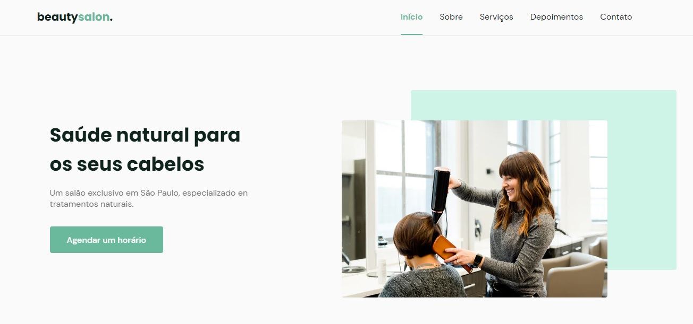

<h1 align="center"> Projeto Beautysalon
<br>
<br>
  
<br>
</h1>

<p align="center">Projeto de site para salão de beleza, desenvolvido durante o treinamento NLW/Together da @rocketseat-education.</p>
<br>
<p align="center"> Acesse a versão de teste em produção através do link: 
<div align="center">

[Clique aqui](https://letmeask-4b7b8.firebaseapp.com/)

</div>
</p>

#

<div align="center" >

## 🚀 Tecnologias

Este projeto foi desenvolvido com as seguintes tecnologias:

- ✔️HTML

- ✔️CSS

- ✔️JavaScript

- ✔️ [Swiper](https://swiperjs.com/)

- ✔️ [ScrollReveal](https://scrollrevealjs.org/)

</br >

**Clone o projeto, entre na pasta e execute-o**

```bash
$ git clone https://github.com/matheuspedrosoo/beatysalon.git && cd beatysalon
```

Matheus pedroso 👋 [Linkedin](https://www.linkedin.com/in/matheuspedrosoo/)
<br>
